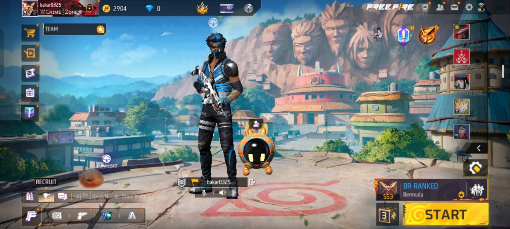
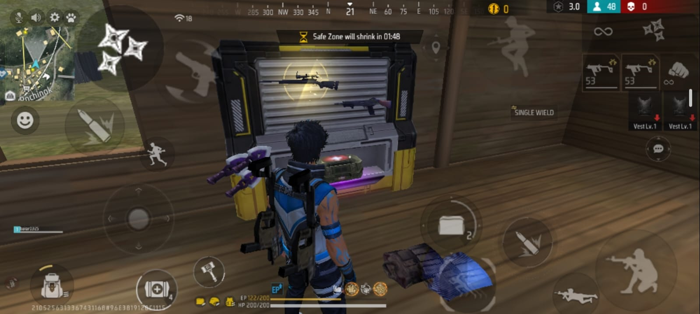
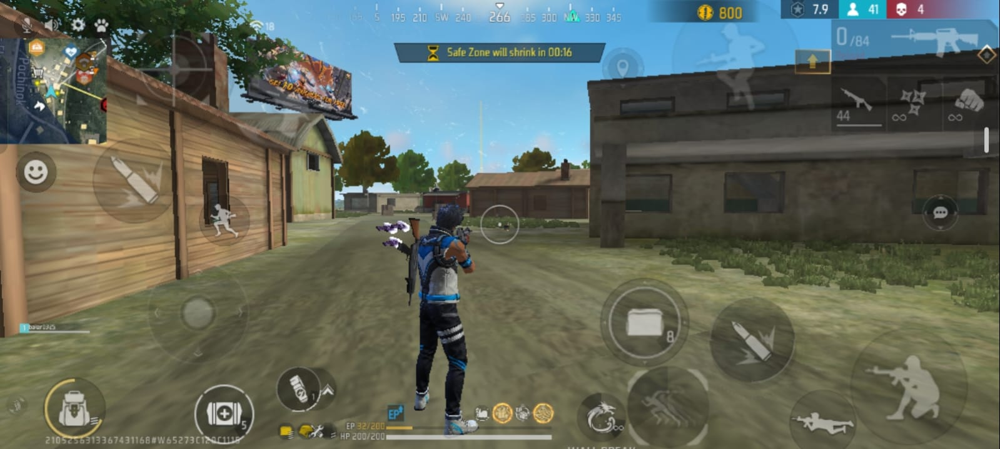
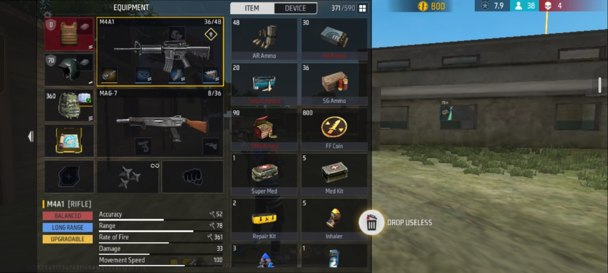
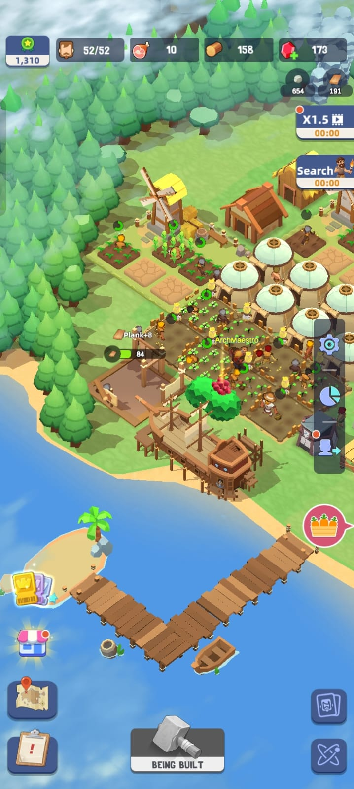
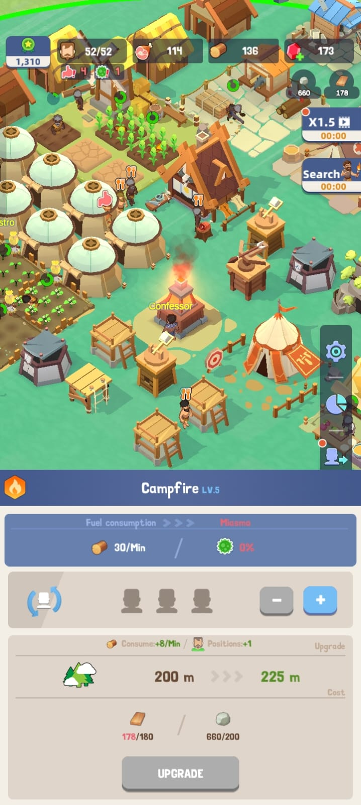
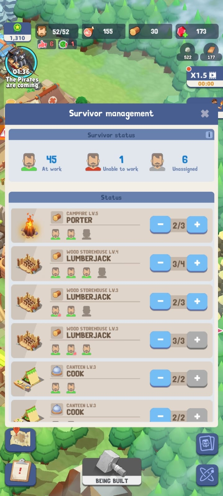
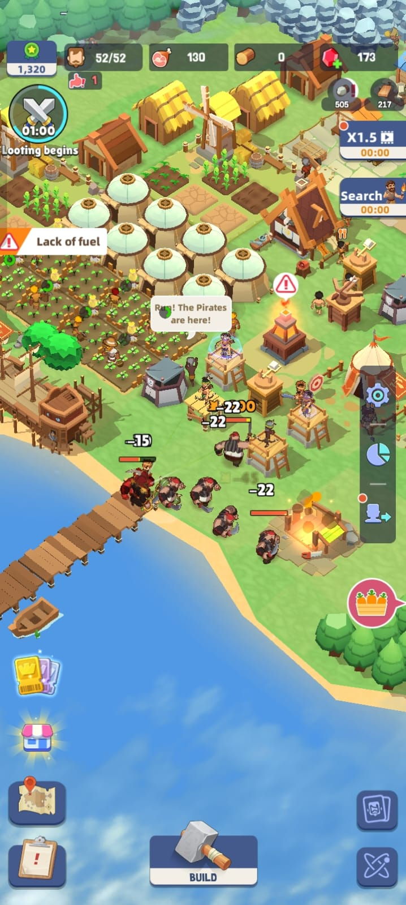

# CS464 Assignment 01 · [  M.Abubakar ] · [BSCS25109]

## Game 1 · Free Fire

- **Store link:** [https://play.google.com/store/apps/details?id=com.dts.freefiremax]
- **Genre:** Battle Royale / Third-Person Shooter
- **I played:** 30 minutes for this assignment. I have also played Free Fire previously and completed several Battle Royale matches.

  
  
  
  
  
  
  

**[M1, M2]** · Choosing a landing area and collecting weapons, ammunition, armor and healing items after landing.
**[M3, M4, M5]** · Staying inside the safe zone while managing ammunition, health and healing during combat.
**[M6, M7]** · Using a Gloo Wall for temporary cover while fighting and trying to eliminate opponents to survive the match.

| # | Mechanic | Dynamic | Aesthetic | Bartle type |
|---|---|---|---|---|
| M1 | At the start of a Battle Royale match, players choose when to leave the aircraft and parachute to a landing location. | Players choose between crowded areas with early combat and quieter areas where they can loot more safely. | **Discovery:** choosing different landing areas encourages players to explore the map and learn useful locations. | **Explorer:** interacting × world, because players learn the map and its locations. |
| M2 | Weapons, ammunition, armor, healing items and other equipment must be collected from loot found around the map. | Players search buildings and nearby areas before or between fights, comparing items and deciding what equipment to keep. | **Discovery:** searching the environment creates anticipation about what useful equipment may be found. | **Explorer:** interacting × world, because players discover resources in the game environment. |
| M3 | The safe zone becomes smaller as the match progresses, and players outside it take damage. | Players repeatedly check the map, move toward the next safe area and sometimes leave strong positions before the zone reaches them. | **Challenge:** players must balance fighting, looting and movement while staying inside the shrinking play area. | **Achiever:** acting × world, because players must overcome an environmental rule to survive. |
| M4 | Guns use ammunition and have limited magazine sizes, so players must reload after firing enough shots. | Players reload behind cover, conserve ammunition and avoid starting a fight with an almost empty magazine. | **Challenge:** combat rewards timing, accuracy and ammunition management rather than unlimited shooting. | **Achiever:** acting × world, because players master the weapon and ammunition system. |
| M5 | Damage reduces health, healing items restore health, and armor provides additional protection. | Injured players retreat behind cover, heal when they have enough time and avoid exposing themselves while vulnerable. | **Challenge:** players must decide when to attack, retreat or spend time healing. | **Achiever:** acting × world, because players manage health and survival systems. |
| M6 | A Gloo Wall can be deployed to create an instant temporary barrier when the player has the required item. | Players place walls when being shot, block enemy sightlines and create temporary cover for healing, reloading or repositioning. | **Expression:** the same defensive tool can be used in different tactical ways depending on the situation. | **Achiever:** acting × world, because players place an object strategically to improve their position. |
| M7 | Players can damage and eliminate opponents, and the Battle Royale match continues until the final surviving player or team wins. | Players hunt opponents, avoid unfavorable fights, ambush enemies and become more careful as fewer players remain. | **Challenge:** every encounter can end the run, so surviving and winning is difficult. | **Killer:** acting × players, because the player directly affects and eliminates other competitors. |

**Aesthetic profile:**  
Free Fire mainly leans on **Challenge, Discovery and Expression**. Challenge is strongest because players must survive gunfights, manage health and ammunition, stay inside the safe zone and outlast opponents. Discovery comes from learning landing locations, map routes and loot locations. Expression appears through tactical choices such as different ways of using Gloo Walls.

**Player types**
- **Primary: Killer (acting × players)**, because defeating and eliminating other human players is central to Battle Royale combat, especially in M7 and supported by M4.
- **Secondary: Achiever (acting × world)**, because players must overcome the safe-zone, ammunition, health and defensive systems to survive and progress through a match (M3, M4, M5, M6).

---

## Game 2 · Survivor Island

- **Store link:** [Paste the Google Play link for the exact Survivor Island game you played]
- **Genre:** Survival / Simulation / Idle
- **I played:** [Write your actual play time, e.g. 40 minutes, and how far you got]

  
  
  
  
  
  
  

**[M1, M2, M3]** · Survivors are working in the settlement while resources are collected and buildings are developed.
**[M4, M6]** · The settlement's survival systems and defenses are maintained to protect the survivors.
**[M5, M7]** · Exploring the island adds new opportunities, while idle progression allows resources or progress to continue over time.

| # | Mechanic | Dynamic | Aesthetic | Bartle type |
|---|---|---|---|---|
| M1 | Survivors can be assigned to different jobs to gather resources and perform work. | Players move workers between jobs depending on which resource is currently needed most. | **Challenge:** survival depends on balancing a limited number of workers efficiently. | **Achiever:** acting × world, because the player optimizes the settlement's production. |
| M2 | Food and other resources are consumed as the settlement operates and grows. | Players prioritize important resources and delay less urgent upgrades when supplies are low. | **Challenge:** players must manage scarcity and avoid running out of essential resources. | **Achiever:** acting × world, because the player manages the game's resource systems. |
| M3 | Buildings require collected resources and are used to expand the settlement. | Players gather materials and decide which buildings or upgrades should be completed first. | **Expression:** players make choices about how they develop and organize the settlement. | **Achiever:** acting × world, because the player develops the island through construction and upgrades. |
| M4 | The settlement includes survival systems that must be maintained, such as the bonfire and other needs shown during play. | Players reserve enough resources to keep important survival systems working instead of spending everything on expansion. | **Challenge:** ignoring one important survival system can threaten the settlement's progress. | **Achiever:** acting × world, because the player maintains systems needed for survival. |
| M5 | New survivors or new areas can be discovered as the player explores the island. | Players explore because discovering more of the island can unlock additional survivors, resources or opportunities. | **Discovery:** exploration reveals new parts of the island and expands what the player can do. | **Explorer:** interacting × world, because the player learns what exists in the environment. |
| M6 | Defensive structures or combat units can be used to protect the settlement from threats. | Players spend some resources on protection instead of using everything for economic growth. | **Challenge:** players must balance expansion with preparation for danger. | **Achiever:** acting × world, because the player builds and improves defenses against game threats. |
| M7 | The game includes idle progression, allowing some production or progress to continue while the player is away. | Players return after a break to collect accumulated resources and begin the next tasks or upgrades. | **Submission:** the game supports short, repeated check-ins as a pastime. | **Achiever:** acting × world, because steady resource and settlement progress is rewarded over time. |

**Aesthetic profile:**  
Survivor Island mainly leans on **Challenge, Discovery and Submission**. Challenge comes from balancing workers, food, resources, development and defenses. Discovery comes from exploring the island and finding new survivors or opportunities. Submission comes from the idle progression system, which supports short sessions and returning later to continue development.

**Player types**
- **Primary: Achiever (acting × world)**, because most mechanics involve managing, building and improving the settlement while overcoming the game's survival systems (M1, M2, M3, M4, M6, M7).
- **Secondary: Explorer (interacting × world)**, because players explore the island and uncover new areas, survivors and opportunities (M5).

---

## Level blockouts

> Complete this section after Part C.

| Level | Screenshot | Its idea | Wayfinding tool |
|---|---|---|---|
| Level01 |  | [Add after building Level01] | [Add wayfinding tool] |
| Level02 |  | [Add after building Level02] | [Add wayfinding tool] |
| Level03 |  | [Add after building Level03] | [Add wayfinding tool] |
| Level04 |  | [Add after building Level04] | [Add wayfinding tool] |
| Level05 |  | [Add after building Level05] | [Add wayfinding tool] |
